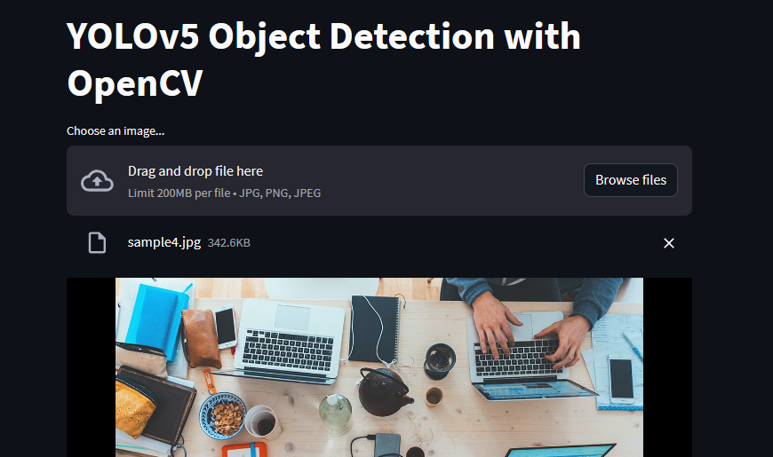

<div align="center">
   <h1>YOLOv5 Object Detection with OpenCV</h1><br>
   <a href="https://hacktoberfest.com/" target="_blank">
      </a> <a href="https://github.com/arindal1" target="_blank">
      </a> <a href="https://twitter.com/arindal_17" target="_blank">
      </a>
   <p>Give this repo a ⭐ and contribute!</p>
</div>
<br>


This repository contains a project demonstrating object detection using the YOLOv5 model, integrated with OpenCV for image processing and Streamlit for a user-friendly interface. It is `hacktober-accepted`, so you can make your Hacktober OpenSource contributions here. Read [CONTRIBUTIONS.md](CONTRIBUTIONS.md) for more info about contributing. <br>


## Overview

The code provided demonstrates loading a YOLOv5 model in ONNX format and using it to perform object detection on input images. The detections are visualized by drawing bounding boxes and labels around the detected objects.

## Prerequisites

- Python 3.x
- OpenCV (`cv2`)
- PyTorch (for model training, not needed for inference)
- COCO Names File (`coco.names`)
- YOLOv5 Model Weights (`yolov5s.onnx`)
- Input Image(s) for Testing

Run the [requirements.txt](requirements.txt)
```python
pip install -r requirements.txt  # install
```

## Usage

1. Clone the repository:
   ```bash
   git clone https://github.com/arindal1/yolov5-onnx-object-recognition.git
  
   cd yolov5-onnx-object-recognition
   ```

2. Ensure you have the necessary model weights (`yolov5s.onnx`) and the COCO class names file (`coco.names`) in the appropriate locations.

3. Run the script to perform object detection on the provided sample image (`sample.jpg`):
   ```bash
   python object_detection.py
   ```

Modify the script to work with your own images.

4. Run the Steamlit app: `app.py`:
   ```python
   streamlit run app.py
   ```


5. Access the app through your web browser at the provided URL (usually http://localhost:8501).
   
6. Drag and drop your Input image onto the box.

## About this Project

- Understand the code at: [ABOUT_THE_CODE.md](config/ABOUT_THE_CODE.md)
- Understand the YOLO algorithm at: [ABOUT_YOLO.md](config/ABOUT_YOLO.md)
- Understand the COCO Dataset at: [ABOUT_COCO.md](config/ABOUT_COCO.md)
- About **Hacktober Fest 2023** at: [HACKTOBER_2023.md](config/HACKTOBER_2023.md)


## Acknowledgments

This project uses the YOLOv5 model and the COCO dataset.
The model weights in ONNX format were obtained from the official YOLOv5 repository [Ultralytics](https://github.com/ultralytics/yolov5).

## Contributions

Contributions to this repo are very welcome. This repository is `hacktober-accepted`, any contributions made will be counted as a part of **Hacktober Fest 2023** if you're participating.
Read **Hacktober Fest [Guildelines](https://hacktoberfest.com/participation/#pr-mr-details)** and [CONTRIBUTIONS.md](CONTRIBUTIONS.md) before making Pull Requests, to make sure you are following Hacktober's PR Rules.
Any issues, features or changes you want to add, fork this repo and make your pull requests accordingly.<br>
See the [open issues](https://github.com/yolov5-onnx-object-recognition/issues) for a list of proposed features (and known issues) or add your own and link them to your Pull Request. <br>

**For more infomation about contributions, please refer to [CONTRIBUTIONS.md](CONTRIBUTIONS.md).**

## Contact

If you have any questions or suggestions related to this project, you can reach out to me at:

- GitHub: [arindal1](https://github.com/arindal1)
- LinkedIn: [arindalchar](https://www.linkedin.com/arindalchar/)
- Twitter: [arindal_17](https://twitter.com/arindal_17)

## External Links

- [Hactober 2023](https://hacktoberfest.com/)
- [YOLOv5 by Ultralytics](https://github.com/ultralytics/yolov5)
- [COCO Dataset](https://cocodataset.org/#home)
- [OpenCV](https://docs.opencv.org/)
- [StreamLit](https://docs.streamlit.io/)
- [YOLO Article](https://pjreddie.com/darknet/yolo/)

## Contributors

<a href="https://github.com/arindal1" target="_blank"></a> <a href="https://github.com/simanders" target="_blank"></a>
  
**Note:** This is a personal project created for educational and demonstrative purposes. I made this project just to learn more about the YOLO model. Feel free to contribute and help me make this project even better.

### Have fun coding and contributing 🚀
