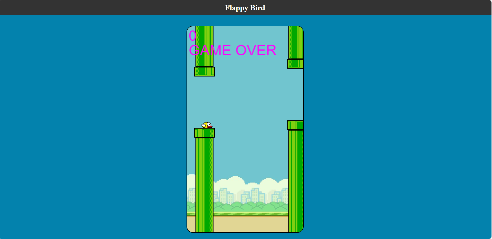

# Flappy-Bird

## Introduction
Flappy Bird is a legendary mobile game that took the world by storm. The objective is simple: guide the flappy bird through a series of pipes without hitting them. The challenge lies in the bird's constant descent, requiring precise taps to keep it afloat.

## Technologies Used
- HTML
- CSS
- JavaScript

## Project Structure
- `index.html`: The main HTML file containing the game's user interface.
- `style.css`: The CSS file for styling the game interface.
- `script.js`: The JavaScript file containing the game logic and interactivity.

## Key Functionalities
- Responsive and user-friendly design
- Realistic physics and fluid animation
- Score tracking to challenge your friends
- Start and restart functionality for endless fun

## How to Play
- Click on Space Bar or Up Arrow Key to Start the Game.
- Control the flappy bird's altitude by clicking or tapping to make it flap its wings.
- Navigate through the pipes, aiming to achieve the highest score possible.
- Navigate through the pipes, aiming to achieve the highest score possible.
- Click on Space Bar or Up Arrow Key to Restart the Game

## Usage
1. Clone the repository using `git clone https://github.com/your-username/tic-tac-toe.git`.
2. Open `index.html` in a web browser to play the game, or click on the link at the bottom to open the github deployment.
3. Click on the buttons to make your moves and enjoy the game!

## Contributing
Contributions to this project are welcome! If you find any bugs or have suggestions for improvements, please open an issue or create a pull request.

<a href="https://shback007.github.io/Flappy-Bird/" target="_blank">Game Link</a>

