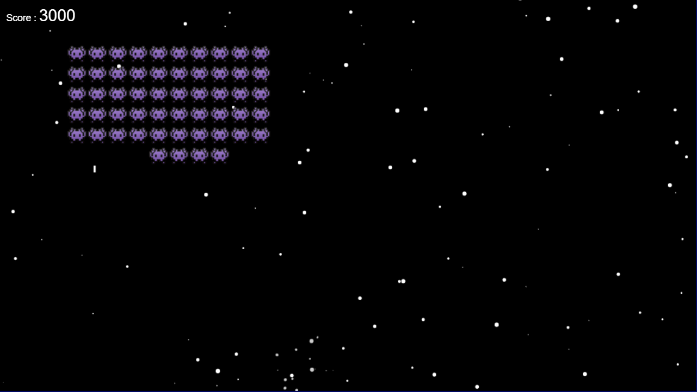

# Space-Invader

## Introduction
Welcome to Space Invaders, an exhilarating and nostalgic arcade game that takes you on a thrilling journey through outer space. Space Invaders is a classic title that has stood the test of time, and now you can enjoy it right here on your computer.Space Invaders is a timeless video game that was first introduced in 1978. It has since become an iconic part of gaming history, captivating players with its simple yet addictive gameplay. In this game, you'll take control of a spaceship tasked with defending Earth from an alien invasion. Waves of relentless extraterrestrial foes descend from the heavens, and it's your mission to shoot them down before they reach the surface.

## Technologies Used
- HTML
- CSS
- JavaScript
## Project Structure
- `index.html`: The main HTML file containing the game's user interface.
- `script.js`: The JavaScript file containing the game logic and interactivity.

## Key Functionalities
- Authentic gameplay faithful to the original Space Invaders.
- Modernized graphics and sound effects for an enhanced gaming experience.
- Open-source code, making it easy for developers to learn, modify, and contribute to the project.

## How to Play
Navigate your spaceship using the arrow keys (or your customized controls), and press the spacebar to shoot lasers at the descending invaders. The objective is simple: eliminate the alien horde while dodging their counterattacks. As the game progresses, the invaders will speed up, making it increasingly challenging to defend Earth.

Are you ready to defend our planet from the alien menace and climb to the top of the leaderboard? Join us in the Space Invaders world, and let's take on the invaders together!

## Contributing
Contributions to this project are welcome! If you find any bugs or have suggestions for improvements, please open an issue or create a pull request.

There are some files added with this repo if you want fork it and use those resources to modify the game even more

<a href="https://shback007.github.io/Space-Invader/" target="_blank">Game Link</a>

